# Jarkom-Modul-2-IT07-2024

- Dimas Andhika Diputra 5027231074
- Kharisma Fahrun Nisa 5027231086

## Topologi Kel IT07

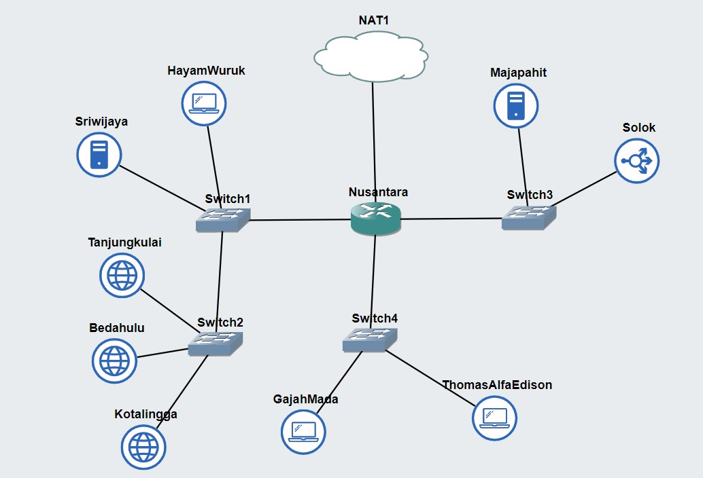

## Soal 1

Untuk mempersiapkan peperangan World War MMXXIV (Iya sebanyak itu), Sriwijaya membuat dua kotanya menjadi web server yaitu Tanjungkulai, dan Bedahulu, serta Sriwijaya sendiri akan menjadi DNS Master. Kemudian karena merasa terdesak, Majapahit memberikan bantuan dan menjadikan kerajaannya (Majapahit) menjadi DNS Slave.

### Nusantara (router)

pada topologi, router terhubung ke 3 switch

```
auto eth0
iface eth0 inet dhcp

auto eth1
iface eth1 inet static
  address 10.67.1.1
  netmask 255.255.255.0

auto eth2
iface eth2 inet static
  address 10.67.2.1
  netmask 255.255.255.0

auto eth3
iface eth3 inet static
  address 10.67.3.1
  netmask 255.255.255.0

up iptables -t nat -A POSTROUTING -o eth0 -j MASQUERADE -s 10.67.0.0/16
```

### Sriwijaya (DNS Master)

```
auto eth0
iface eth0 inet static
  address 10.67.1.2
  netmask 255.255.255.0
  gateway 10.67.1.1

up echo nameserver 192.168.122.1 >> /etc/resolv.conf
```

dns master juga perlu setup `bind9` dan `dnsutils`

```
apt-get update && apt-get install bind9 dnsutils -y
```

### Majapahit (DNS Slave)

```
auto eth0
iface eth0 inet static
  address 10.67.3.2
  netmask 255.255.255.0
  gateway 10.67.3.1

up echo nameserver 192.168.122.1 >> /etc/resolv.conf
```

dns slave juga perlu setup `bind9` dan `dnsutils`

```
apt-get update && apt-get install bind9 dnsutils -y
```

### HayamWuruk (client)

```
auto eth0
iface eth0 inet static
  address 10.67.1.3
  netmask 255.255.255.0
  gateway 10.67.1.1

up echo nameserver 10.67.1.2 >> /etc/resolv.conf
```

### GajahMada (client)

```
auto eth0
iface eth0 inet static
  address 10.67.2.3
  netmask 255.255.255.0
  gateway 10.67.2.1

up echo nameserver 10.67.1.2 >> /etc/resolv.conf
```

### ThomasAlfaEdison (client)

```
auto eth0
iface eth0 inet static
  address 10.67.2.2
  netmask 255.255.255.0
  gateway 10.67.2.1

up echo nameserver 10.67.1.2 >> /etc/resolv.conf
```

### Tanjungkulai (web server)

```
auto eth0
iface eth0 inet static
  address 10.67.1.4
  netmask 255.255.255.0
  gateway 10.67.1.1
```

### Bedahulu (web server)

```
auto eth0
iface eth0 inet static
  address 10.67.1.5
  netmask 255.255.255.0
  gateway 10.67.1.1
```

### Kotalingga (web server)

```
auto eth0
iface eth0 inet static
  address 10.67.1.6
  netmask 255.255.255.0
  gateway 10.67.1.1
```

## Soal 2

Karena para pasukan membutuhkan koordinasi untuk melancarkan serangannya, maka buatlah sebuah domain yang mengarah ke Solok dengan alamat sudarsana.xxxx.com dengan alias www.sudarsana.xxxx.com, dimana xxxx merupakan kode kelompok. Contoh: sudarsana.it01.com.

### Sriwijaya (DNS)

```
nano /etc/bind/named.conf.local
```

tambah domain baru

```
zone "sudarsana.it07.com" {
    type master;
    file "/etc/bind/it07/sudarsana.it07.com";
};
```

buat dns record

```
cp /etc/bind/db.local /etc/bind/it07/sudarsana.it07.com
```

edit dns record arahkan ke ip solok `10.67.3.3`

```
;
; BIND data file for local loopback interface
;
$TTL    604800
@       IN      SOA     sudarsana.it07.com. root.sudarsana.it07.com. (
                              2         ; Serial
                         604800         ; Refresh
                          86400         ; Retry
                        2419200         ; Expire
                         604800 )       ; Negative Cache TTL
;
@       IN      NS      sudarsana.it07.com.
@       IN      A       10.67.3.3
@       IN      AAAA    ::1
www     IN      CNAME   sudarsana.it07.com.
```

restart bind9

```
service bind9 restart
```

## Soal 3

Para pasukan juga perlu mengetahui mana titik yang akan diserang, sehingga dibutuhkan domain lain yaitu pasopati.xxxx.com dengan alias www.pasopati.xxxx.com yang mengarah ke Kotalingga.

### Sriwijaya (DNS)

```
nano /etc/bind/named.conf.local
```

tambah domain baru

```
zone "pasopati.it07.com" {
    type master;
    file "/etc/bind/it07/pasopati.it07.com";
};
```

buat dns record

```
cp /etc/bind/db.local /etc/bind/it07/pasopati.it07.com
```

edit dns record arahkan ke ip kotalingga `10.67.1.6`

```
;
; BIND data file for local loopback interface
;
$TTL    604800
@       IN      SOA     pasopati.it07.com. root.pasopati.it07.com. (
                              2         ; Serial
                         604800         ; Refresh
                          86400         ; Retry
                        2419200         ; Expire
                         604800 )       ; Negative Cache TTL
;
@       IN      NS      pasopati.it07.com.
@       IN      A       10.67.1.6
@       IN      AAAA    ::1
www     IN      CNAME   pasopati.it07.com.
```

restart bind9

```
service bind9 restart
```

## Soal 4

Markas pusat meminta dibuatnya domain khusus untuk menaruh informasi persenjataan dan suplai yang tersebar. Informasi dan suplai meme terbaru tersebut mengarah ke Tanjungkulai dan domain yang ingin digunakan adalah rujapala.xxxx.com dengan alias www.rujapala.xxxx.com.

### Sriwijaya (DNS)

```
nano /etc/bind/named.conf.local
```

tambah domain baru

```
zone "rujapala.it07.com" {
    type master;
    file "/etc/bind/it07/rujapala.it07.com";
};
```

buat dns record

```
cp /etc/bind/db.local /etc/bind/it07/rujapala.it07.com
```

edit dns record arahkan ke ip Tanjungkulai `10.67.1.4`

```
;
; BIND data file for local loopback interface
;
$TTL    604800
@       IN      SOA     rujapala.it07.com. root.rujapala.it07.com. (
                              2         ; Serial
                         604800         ; Refresh
                          86400         ; Retry
                        2419200         ; Expire
                         604800 )       ; Negative Cache TTL
;
@       IN      NS      rujapala.it07.com.
@       IN      A       10.67.1.4
@       IN      AAAA    ::1
www     IN      CNAME   rujapala.it07.com.
```

restart bind9

```
service bind9 restart
```

## Soal 5

Pastikan domain-domain tersebut dapat diakses oleh seluruh komputer (client) yang berada di Nusantara.

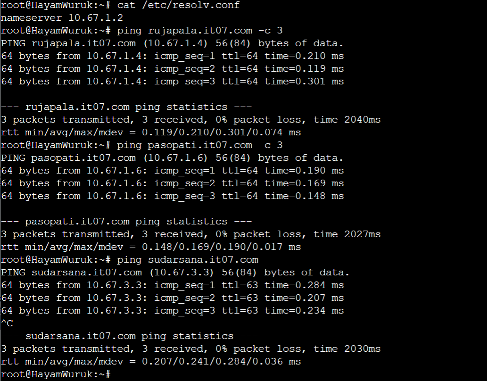
hasil dari ping ke domain yang telah dibuat dari client HayamWuruk. Semua client bekerja karena sudah ditambahkan nameserver ke ip dns pada /etc/resolv.conf

berikut hasil untuk subdomain www:
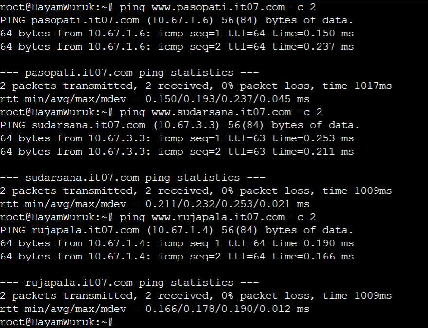

## Soal 6

Beberapa daerah memiliki keterbatasan yang menyebabkan hanya dapat mengakses domain secara langsung melalui alamat IP domain tersebut. Karena daerah tersebut tidak diketahui secara spesifik, pastikan semua komputer (client) dapat mengakses domain pasopati.xxxx.com melalui alamat IP Kotalingga (Notes: menggunakan pointer record).

### Sriwijaya (DNS)

```
nano /etc/bind/named.conf.local
```

tambahkan pointer record ip kotalingga

```
zone "1.67.10.in-addr.arpa" {
    type master;
    file "/etc/bind/it07/1.67.10.in-addr.arpa";
};
```

buat dns record

```
cp /etc/bind/db.local /etc/bind/it07/1.67.10.in-addr.arpa
```

edit dns record

```
;
; BIND data file for local loopback interface
;
$TTL    604800
@       IN      SOA     pasopati.it07.com. root.pasopati.it07.com. (
                              2         ; Serial
                         604800         ; Refresh
                          86400         ; Retry
                        2419200         ; Expire
                         604800 )       ; Negative Cache TTL
;
1.67.10.in-addr.arpa.   IN  NS          pasopati.it07.com.
6                       IN  PTR         pasopati.it07.com.
```

restart bind9

```
service bind9 restart
```

tes pointer record<br>
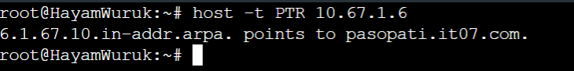

## Soal 7

Akhir-akhir ini seringkali terjadi serangan brainrot ke DNS Server Utama, sebagai tindakan antisipasi kamu diperintahkan untuk membuat DNS Slave di Majapahit untuk semua domain yang sudah dibuat sebelumnya yang mengarah ke Sriwijaya.

### Sriwijaya (DNS Master)

edit `/etc/bind/named.conf.local`

```
zone "sudarsana.it07.com" {
    type master;
    notify yes;
    also-notify { 10.67.3.2; };
    allow-transfer { 10.67.3.2; };
    file "/etc/bind/it07/sudarsana.it07.com";
};

zone "pasopati.it07.com" {
    type master;
    notify yes;
    also-notify { 10.67.3.2; };
    allow-transfer { 10.67.3.2; };
    file "/etc/bind/it07/pasopati.it07.com";
};

zone "rujapala.it07.com" {
    type master;
    notify yes;
    also-notify { 10.67.3.2; };
    allow-transfer { 10.67.3.2; };
    file "/etc/bind/it07/rujapala.it07.com";
};

zone "1.67.10.in-addr.arpa" {
    type master;
    file "/etc/bind/it07/1.67.10.in-addr.arpa";
};
```

restart bind9

```
service bind9 restart
```

### Majapahit (DNS Slave)

edit `/etc/bind/named.conf.local`

```
zone "sudarsana.it07.com" {
    type slave;
    masters { 10.67.1.2; };
    file "/var/lib/bind/sudarsana.it07.com";
};

zone "pasopati.it07.com" {
    type slave;
    masters { 10.67.1.2; };
    file "/var/lib/bind/pasopati.it07.com";
};

zone "rujapala.it07.com" {
    type slave;
    masters { 10.67.1.2; };
    file "/var/lib/bind/rujapala.it07.com";
};
```

restart bind9

```
service bind9 restart
```

### Testing

tambah semua client nameserver tambahan, sehingga isi dari `/etc/resolv.conf` menjadi seperti ini:

```
nameserver 10.67.1.2
nameserver 10.67.3.2
```

hal tsb dilakukan agar jika nameserver pertama tidak bisa dipanggil akan menggunakan name server kedua

hasil (Sriwijaya mati):
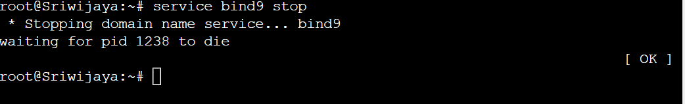
masi bisa ping:
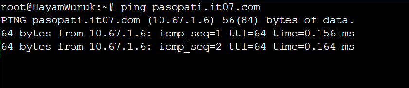

## Soal 8

Kamu juga diperintahkan untuk membuat subdomain khusus melacak kekuatan tersembunyi di Ohio dengan subdomain cakra.sudarsana.xxxx.com yang mengarah ke Bedahulu.

### Sriwijaya (DNS Master)

edit dns rec tambah subdomain cakra yang menuju ke Bedahulu `10.67.1.5`

```
;
; BIND data file for local loopback interface
;
$TTL    604800
@       IN      SOA     sudarsana.it07.com. root.sudarsana.it07.com. (
                              2         ; Serial
                         604800         ; Refresh
                          86400         ; Retry
                        2419200         ; Expire
                         604800 )       ; Negative Cache TTL
;
@       IN      NS      sudarsana.it07.com.
@       IN      A       10.67.3.3
@       IN      AAAA    ::1
www     IN      CNAME   sudarsana.it07.com.
cakra   IN      A       10.67.1.5
```

restart bind9

```
service bind9 restart
```

hasil test:
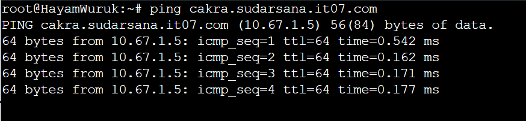

## Soal 9

Karena terjadi serangan DDOS oleh shikanoko nokonoko koshitantan (NUN), sehingga sistem komunikasinya terhalang. Untuk melindungi warga, kita diperlukan untuk membuat sistem peringatan dari siren man oleh Frekuensi Freak dan memasukkannya ke subdomain panah.pasopati.xxxx.com dalam folder panah dan pastikan dapat diakses secara mudah dengan menambahkan alias www.panah.pasopati.xxxx.com dan mendelegasikan subdomain tersebut ke Majapahit dengan alamat IP menuju radar di Kotalingga.

### Sriwijaya (DNS Master)

edit `/etc/bind/it07/pasopati.it07.com` buat delegasi ke majapahit `10.67.3.2`

```
;
; BIND data file for local loopback interface
;
$TTL    604800
@       IN      SOA     pasopati.it07.com. root.pasopati.it07.com. (
                              2         ; Serial
                         604800         ; Refresh
                          86400         ; Retry
                        2419200         ; Expire
                         604800 )       ; Negative Cache TTL
;
@       IN      NS      pasopati.it07.com.
@       IN      A       10.67.1.6
@       IN      AAAA    ::1
www     IN      CNAME   pasopati.it07.com.
ns1     IN      A       10.67.3.2
panah   IN      NS      ns1
```

edit `/etc/bind/named.conf.options`

```
options {
    directory "/var/cache/bind";
    //dnssec-validation auto;
    allow-query{any;};

    auth-nxdomain no;    # conform to RFC1035
    listen-on-v6 { any; };
};
```

restart bind9

```
service bind9 restart
```

### Majapahit (DNS Slave)

edit `/etc/bind/named.conf.options`

```
options {
    directory "/var/cache/bind";
    //dnssec-validation auto;
    allow-query{any;};

    auth-nxdomain no;    # conform to RFC1035
    listen-on-v6 { any; };
};
```

edit `/etc/bind/named.conf.local`

```
zone "sudarsana.it07.com" {
    type slave;
    masters { 10.67.1.2; };
    file "/var/lib/bind/sudarsana.it07.com";
};

zone "pasopati.it07.com" {
    type slave;
    masters { 10.67.1.2; };
    file "/var/lib/bind/pasopati.it07.com";
};

zone "rujapala.it07.com" {
    type slave;
    masters { 10.67.1.2; };
    file "/var/lib/bind/rujapala.it07.com";
};

zone "panah.pasopati.it07.com" {
    type master;
    file "/etc/bind/panah/panah.pasopati.it07.com";
};
```

buat direktori `/etc/bind/panah` lalu edit `panah.pasopati.it07.com` yang menuju kotalingga `10.67.1.6`

```
;
; BIND data file for local loopback interface
;
$TTL    604800
@       IN      SOA     panah.pasopati.it07.com. root.panah.pasopati.it07.com. (
                              2         ; Serial
                         604800         ; Refresh
                          86400         ; Retry
                        2419200         ; Expire
                         604800 )       ; Negative Cache TTL
;
@       IN      NS      panah.pasopati.it07.com.
@       IN      A       10.67.1.6
@       IN      AAAA    ::1
www     IN      CNAME   panah.pasopati.it07.com.
```

restart bind9

```
service bind9 restart
```

berikut test delegasi subdomain panah:
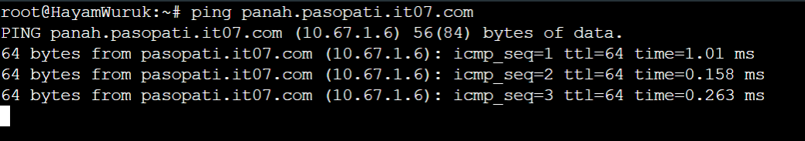

## Soal 10

Markas juga meminta catatan kapan saja meme brain rot akan dijatuhkan, maka buatlah subdomain baru di subdomain panah yaitu log.panah.pasopati.xxxx.com serta aliasnya www.log.panah.pasopati.xxxx.com yang juga mengarah ke Kotalingga.

### Majapahit (DNS Slave)

edit `/etc/bind/panah/panah.pasopati.it07.com` tambahin subdomain log + cname baru bedanya bukan www aja tapi www.log

```
;
; BIND data file for local loopback interface
;
$TTL    604800
@       IN      SOA     panah.pasopati.it07.com. root.panah.pasopati.it07.com. (
                              2         ; Serial
                         604800         ; Refresh
                          86400         ; Retry
                        2419200         ; Expire
                         604800 )       ; Negative Cache TTL
;
@       IN      NS      panah.pasopati.it07.com.
@       IN      A       10.67.1.6
@       IN      AAAA    ::1
www     IN      CNAME   panah.pasopati.it07.com.
log     IN      A       10.67.1.6
www.log IN      CNAME   panah.pasopati.it07.com.
```

restart bind9

```
service bind9 restart
```

ping `log.panah.pasopati.it07.com` & `www.log.panah.pasopati.it07.com`
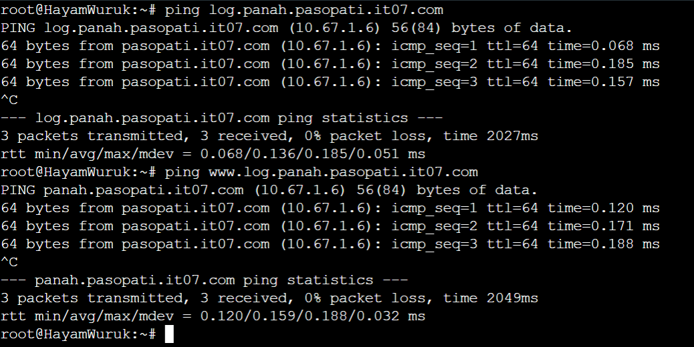

## Soal 11

Setelah pertempuran mereda, warga IT dapat kembali mengakses jaringan luar dan menikmati meme brainrot terbaru, tetapi hanya warga Majapahit saja yang dapat mengakses jaringan luar secara langsung. Buatlah konfigurasi agar warga IT yang berada diluar Majapahit dapat mengakses jaringan luar melalui DNS Server Majapahit.

- asumsi yang dimaksud soal adalah Sriwijaya, tetapi setting di sriwijaya maupun majapahit tidak berpengaruh, sama2 bisa karena tiap client punya kedua nameserver dari dns tersebut

### Majapahit (DNS Slave)

edit `/etc/bind/named.conf.options` tambahkan dns forwarder

```
options {
    directory "/var/cache/bind";

    forwarders {
        192.168.122.1;
    }

    //dnssec-validation auto;
    allow-query{any;};

    auth-nxdomain no;    # conform to RFC1035
    listen-on-v6 { any; };
};
```

restart bind9

```
service bind9 restart
```

test client pakai internet
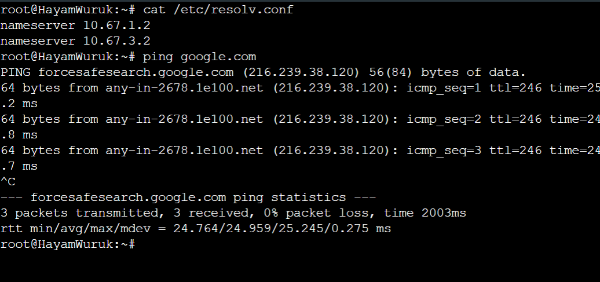

## Soal 12

Karena pusat ingin sebuah laman web yang ingin digunakan untuk memantau kondisi kota lainnya maka deploy laman web ini (cek resource yg lb) pada Kotalingga menggunakan apache.

### Kotalingga (web server) 10.67.1.6

setup apache

```
apt-get update
apt-get install apache2 libapache2-mod-php7.0 php wget unzip -y
```

lalu config apache agar sesuai dengan template web yang disediakan di soal shift

```
cp /etc/apache2/sites-available/000-default.conf /etc/apache2/sites-available/pasopati.it07.com.conf
```

sesuaikan config agar kita dapat akses dengan `pasopati.it07.com` juga tidak hanya dengan ip

```
<VirtualHost *:80>
    ServerAdmin webmaster@localhost
    DocumentRoot /var/www/pasopati.it07.com
    ServerName pasopati.it07.com
    ServerAlias www.pasopati.it07.com
</VirtualHost>
```

setelah itu import folder lbnya untuk apache

```
mkdir /var/www/pasopati.it07.com

a2ensite pasopati.it07.com.conf

wget --no-check-certificate 'https://docs.google.com/uc?export=download&id=1Sqf0TIiybYyUp5nyab4twy9svkgq8bi7' -O lb.zip

unzip lb.zip  -d  lb

mv lb/* /var/www/pasopati.it07.com

cp /var/www/pasopati.it07.com/worker/index.php /var/www/pasopati.it07.com/index.php

cp /var/www/pasopati.it07.com/index.php /var/www/html/index.php
rm /var/www/html/index.html
```

2 command terakhir agar kita bisa akses `lynx pasopati.it07.com` dan `lynx 10.67.1.6`, setelah itu restart apache

```
service apache2 restart
```

### Testing dari salah satu client

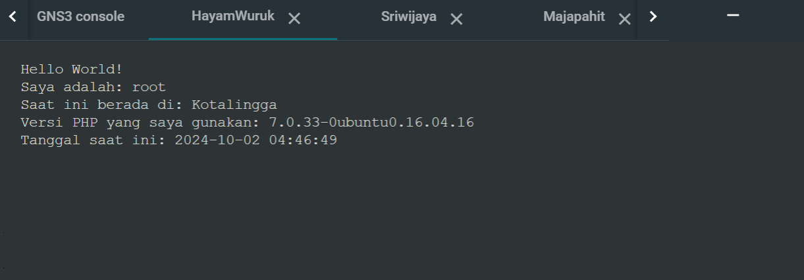

## Soal 13

Karena Sriwijaya dan Majapahit memenangkan pertempuran ini dan memiliki banyak uang dari hasil penjarahan (sebanyak 35 juta, belum dipotong pajak) maka pusat meminta kita memasang load balancer untuk membagikan uangnya pada web nya, dengan Kotalingga, Bedahulu, Tanjungkulai sebagai worker dan Solok sebagai Load Balancer menggunakan apache sebagai web server nya dan load balancer nya.

### Solok (load balancer)

setup load balancer menggunakan apache2

```
apt-get update && apt-get install apache2 -y

a2enmod proxy
a2enmod proxy_balancer
a2enmod proxy_http
a2enmod lbmethod_byrequests
```

set config apache di `/etc/apache2/sites-available/000-default.conf`

```
<VirtualHost *:80>
    <Proxy balancer://mycluster>
        BalancerMember http://10.67.1.4
        BalancerMember http://10.67.1.5
        BalancerMember http://10.67.1.6
        ProxySet lbmethod=byrequests
    </Proxy>

    ProxyPass / balancer://mycluster/
    ProxyPassReverse / balancer://mycluster/

</VirtualHost>
```

lalu mulai atau restart apache2

### Tanjungkulai, Bedahulu, Kotalingga (web server)

lakukan config pada setiap web server seperti nomor 12

### Testing

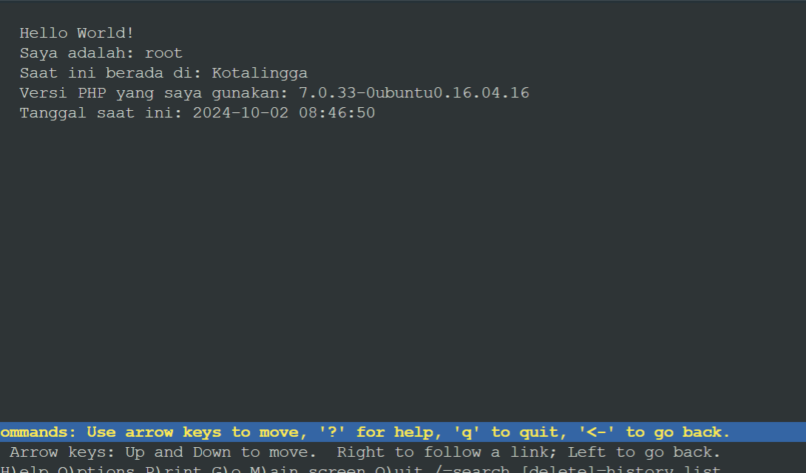
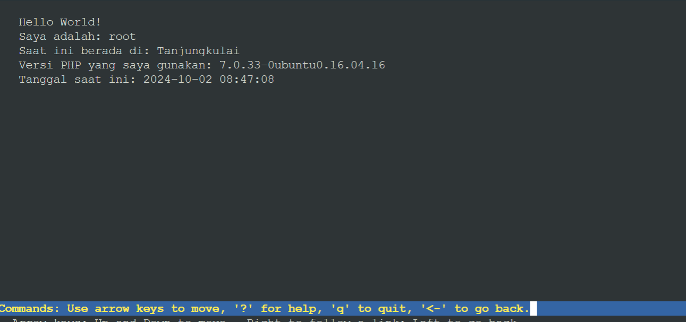
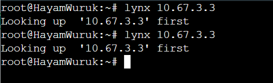

## Soal 14

Selama melakukan penjarahan mereka melihat bagaimana web server luar negeri, hal ini membuat mereka iri, dengki, sirik dan ingin flexing sehingga meminta agar web server dan load balancer nya diubah menjadi nginx.

**tiap web server dan load balancer perlu dimatikan dulu service apache2nya**

### Tanjungkulai, Bedahulu, Kotalingga (web server)

install nginx, dan php-fpm untuk support lynx

```
apt-get install nginx php-fpm -y
```

langsung saja edit file config sesuai domain dari web server, contoh Kotalingga dengan domain pasopati:

```
server {
    listen 80;

    root /var/www/pasopati.it07.com;

    index index.php index.html index.htm;
    server_name _ pasopati.it07.com www.pasopati.it07.com;

    location / {
        try_files $uri $uri/ /index.php?$query_string;
    }

    # pass PHP scripts to FastCGI server
    location ~ \.php$ {
        include snippets/fastcgi-php.conf;
        fastcgi_pass unix:/var/run/php/php7.0-fpm.sock;
    }

    location ~ /\.ht {
        deny all;
    }
}
```

file diatas dimasukkan ke `/etc/nginx/sites-available/domain`, dalam kasus ini `/etc/nginx/sites-available/pasopati.it07.com`

lalu perlu clone ke folder `sites-enabled` dan juga remove file default page nginxnya

```
ln -s /etc/nginx/sites-available/pasopati.it07.com /etc/nginx/sites-enabled/pasopati.it07.com
rm /etc/nginx/sites-enabled/default
```

restart nginx dan php fpm

```
service nginx restart
service php7.0-fpm start
```

### Solok (load balancer)

install nginx

```
apt-get install nginx -y
```

edit config nginx, `/etc/nginx/sites-available/solok`

```
upstream webserver  {
    server 10.67.1.4;
    server 10.67.1.5;
    server 10.67.1.6;
}

server {
    listen 80;
    server_name _;

    location / {
        proxy_pass http://webserver;
    }
}
```

link dengan `sites-enabled` lalu hapus config default nginx

```
ln -s /etc/nginx/sites-available/solok /etc/nginx/sites-enabled/solok
rm /etc/nginx/sites-enabled/default
```

restart nginx

```
service nginx restart
```

### Testing

sudah menggunakan nginx
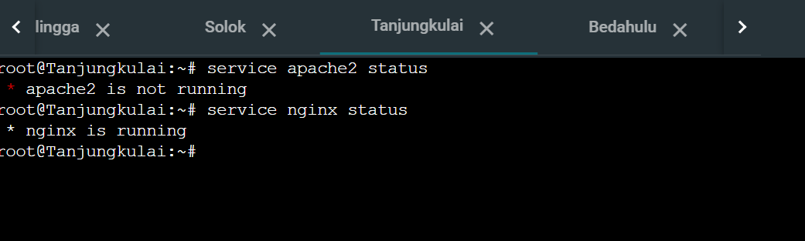

test load balancer
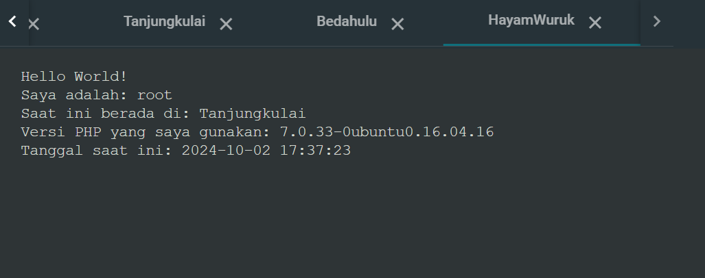
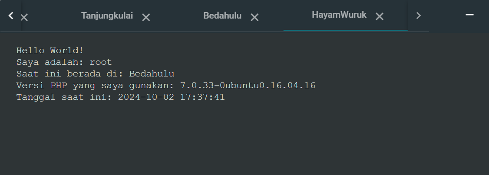

## Soal 15

Markas pusat meminta laporan hasil benchmark dengan menggunakan apache benchmark dari load balancer dengan 2 web server yang berbeda tersebut dan meminta secara detail dengan ketentuan:

- Nama Algoritma Load Balancer
- Report hasil testing apache benchmark
- Grafik request per second untuk masing masing algoritma.
- Analisis
- Meme terbaik kalian (terserah ( ͡° ͜ʖ ͡°)) 🤓

### Round robin

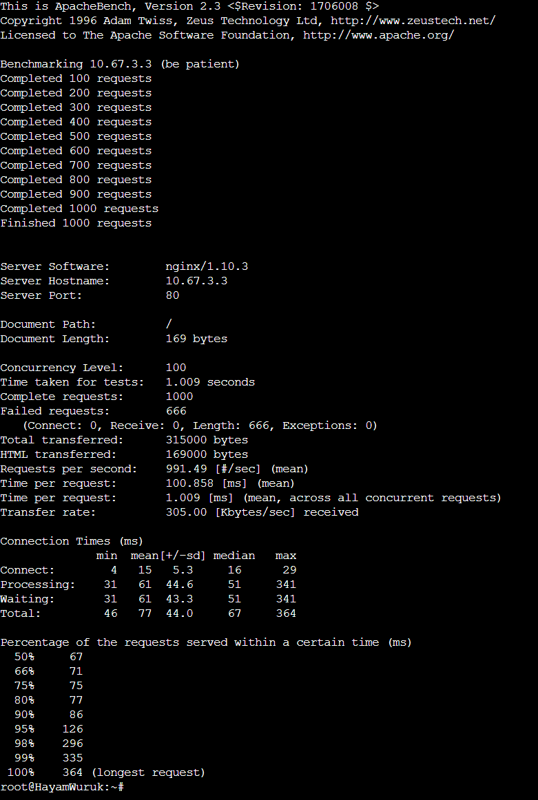

### Least conn

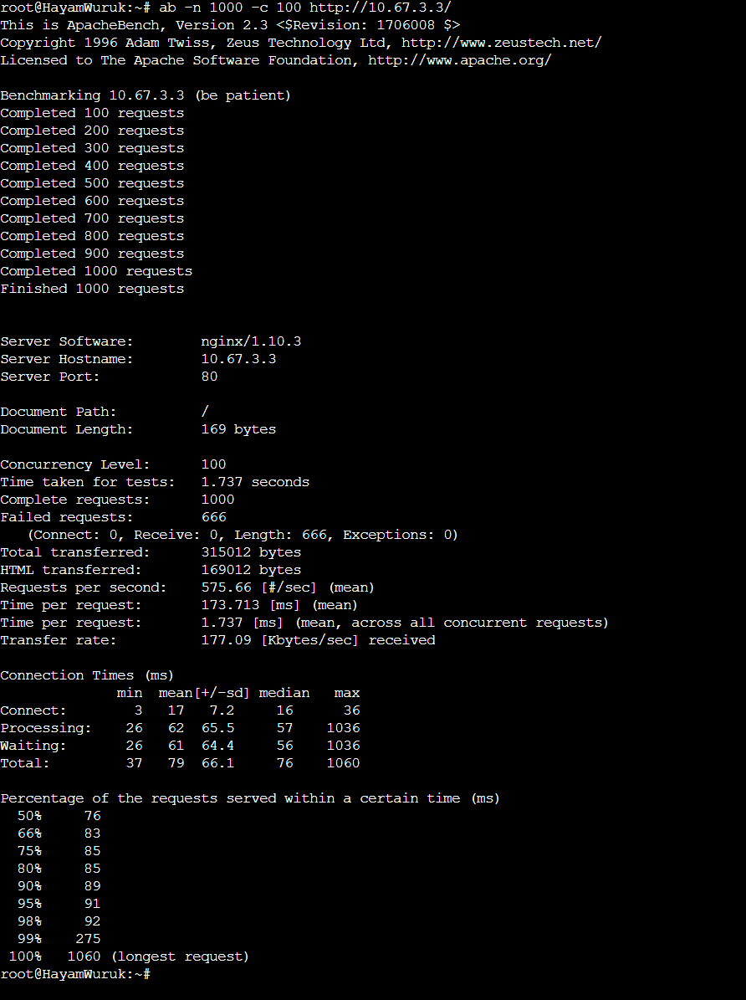

### IP Hash

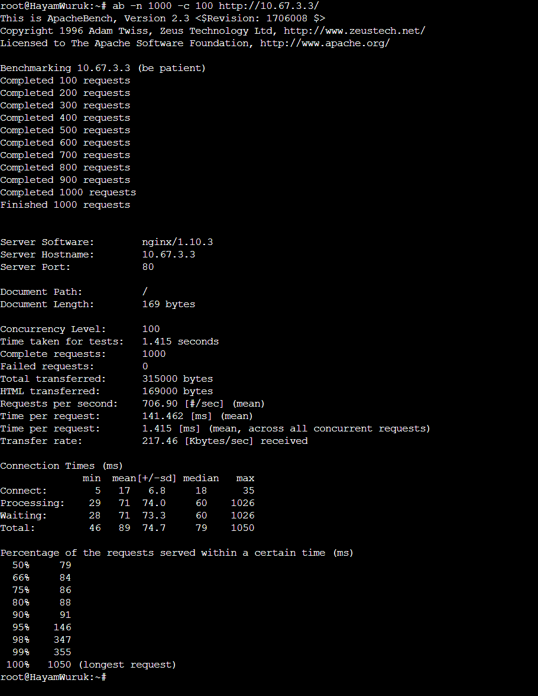

### Generic Hash

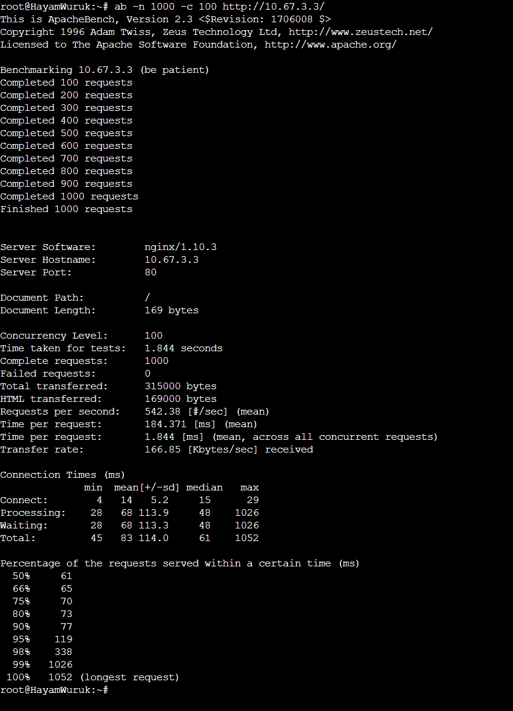

### Rangkuman hasil benchmark

```
round robin:
complete req: 1000
failed req: 666
time taken for test: 1.009 s
rps: 991.49 #/sec (mean)
tpr: 100.858 ms (mean)
transfer rate: 305 kb/sec

least conn:
complete req: 1000
failed req: 666
time taken for test: 1.737 s
rps: 575.66 #/sec (mean)
tpr: 173.713 ms (mean)
transfer rate: 177.09 kb/sec

ip hash:
complete req: 1000
failed req: 0
time taken for test: 1.415 s
rps: 706.90 #/sec (mean)
tpr: 141.462 ms (mean)
transfer rate: 217.46 kb/sec

generic hash:
complete req: 1000
failed req: 0
time taken for test: 1.844 s
rps: 542.38 #/sec (mean)
tpr: 184.371 ms (mean)
transfer rate: 166.85 kb/sec
```

**analisis**

> Baik Round Robin dan Least Conn punya tingkat kegagalan yang tinggi yaitu 66,6% dengan 666 request yang gagal, meskipun Round Robin mencapai throughput tertinggi pada 991,49 RPS dan TPR terendah pada 100,858 ms. Sebaliknya, IP Hash dan Generic Hash stabil karena punya 0 permintaan yang gagal, dengan IP Hash menghasilkan 706.90 RPS dan TPR 141.462 ms. Round Robin juga unggul di kecepatan transfer dengan 305 KB/detik, sementara algoritma lainnya memiliki kecepatan transfer yang lebih rendah.

### Rangkuman hasil benchmark web server thdp semua algo

**semua gambar hasil benchmark ada di folder webserver**

```
roundrobin webserver6:
time: 0.599 s
complete 1000/1000
rps: 1668 /sec
transfer rate: 513.34 kb/sec

leastconn webserver6:
time: 0.389 s
complete 1000/1000
rps: 2571 /sec
transfer rate: 791 kb/sec

iphash webserver6:
time: 0.414 s
complete 1000/1000
rps: 2413 /sec
transfer rate: 742 kb/sec

generichash webserver6:
time: 0.364 s
complete 1000/1000
rps: 2747 /sec
transfer rate: 845 kb/sec

roundrobin webserver5:
time: 0.592 s
complete 1000/1000
rps: 1688 /sec
transfer rate: 516 kb/sec

leastconn webserver5:
time: 0.376 s
comp 1000/1000
rps: 2662 /sec
transfer rate: 813 kb/sec

iphash webserver5:
time: 0.419 s
comp 1000/1000
rps: 2386 /sec
transfer rate: 729 kb/sec

generichash webserver5:
time: 0.365 s
comp 1000/1000
rps: 2741 /sec
transfer rate: 837 kb/sec

roundrobin webserver4:
time: 0.357 s
comp 1000/1000
rps: 2805 /sec
transfer rate: 868 kb/sec

leastconn webserver4:
time: 0.470 s
comp 1000/1000
rps: 2125 /sec
transfer rate: 658 kb/sec

iphash webserver4:
time: 0.401 s
comp 1000/1000
rps: 2493 /sec
transfer rate: 771 kb/sec

generichash webserver4:
time: 0.385 s
comp 1000/1000
rps: 2597 /sec
transfer rate: 803 kb/sec
```

**analisis:**

> Node tanjungkulai unggul dari yang lain di sebagian besar algo. terlihat dari (RPS) tertinggi dan waktu respons tercepat, terutama dengan algo roundrobin (2805 RPS dalam 0,357 detik) dan algo generichash (2597 RPS dalam 0,385 detik). tanjungkulai juga mencapai kecepatan transfer tertinggi di beberapa benchmark, sampai 868 kb/detik memakai roundrobin. Sebaliknya, kotalingga dan bedahulu sedikit tertinggal, dengan RPS yang sedikit lebih rendah dan waktu respons yang lebih lama secara umum.

### web server terbaik = tanjungkulai

**me to jarkom:**


## Soal 16

Karena dirasa kurang aman dari brainrot karena masih memakai IP, markas ingin akses ke Solok memakai solok.xxxx.com dengan alias www.solok.xxxx.com (sesuai web server terbaik hasil analisis kalian). **tanjungkulai**

**izin masuk, sepertinya soal kurang jelas. Di nomor 16 tertera diminta buat domain solok untuk ke ip solok. jadi apakah domain solok ke ip solok atau domain solok ke webserver? mengingat 22nya sudah punya domain**

### Sriwijaya (DNS Master)

edit `/etc/bind/named.conf.local` tambah zone baru

```
zone "solok.it07.com" {
    type master;
    file "/etc/bind/it07/solok.it07.com";
};
```

edit dns record dengan terlebih dahulu copy `db.local` ke ip web server terbaik berdasarkan analisis `10.67.1.4`

```
;
; BIND data file for local loopback interface
;
$TTL    604800
@       IN      SOA     solok.it07.com. root.solok.it07.com. (
                              2         ; Serial
                         604800         ; Refresh
                          86400         ; Retry
                        2419200         ; Expire
                         604800 )       ; Negative Cache TTL
;
@       IN      NS      solok.it07.com.
@       IN      A       10.67.1.4
@       IN      AAAA    ::1
www     IN      CNAME   solok.it07.com.
```

restart bind

```
service bind9 restart
```

### Web server terbaik (tanjungkulai)

edit `/etc/nginx/sites-available/rujapala.it07.com` tambahkan domain solok

```
server {
    listen 80;

    root /var/www/rujapala.it07.com;

    index index.php index.html index.htm;
    server_name _ rujapala.it07.com solok.it07.com www.rujapala.it07.com www.solok.it07.com;

    location / {
        try_files $uri $uri/ /index.php?$query_string;
    }

    # pass PHP scripts to FastCGI server
    location ~ \.php$ {
        include snippets/fastcgi-php.conf;
        fastcgi_pass unix:/var/run/php/php7.0-fpm.sock;
    }

    location ~ /\.ht {
        deny all;
    }
}
```

restart nginx

```
service nginx restart
```

### Testing

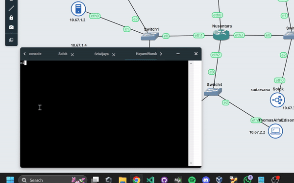

## Soal 17

Agar aman, buatlah konfigurasi agar solok.xxx.com hanya dapat diakses melalui port sebesar π x 10^4 = (phi nya desimal) dan 2000 + 2000 log 10 (10) +700 - π = ?.

- 3,14 x 10^4 = 31400
- 2000 + 2000 log 10 (10) + 700 - 3,14 = kurleb 4696

**karena pada nomor sebelumnya domain solok untuk webserver terbaik yang telah dibenchmark, maka dari itu config portnya dari tanjungkulai**

### Tanjungkulai (web server)

edit `/etc/nginx/sites-available/rujapala.it07.com`

```
server {
    listen 31400;

    root /var/www/rujapala.it07.com;

    index index.php index.html index.htm;
    server_name _ rujapala.it07.com solok.it07.com www.rujapala.it07.com www.solok.it07.com;

    location / {
        try_files $uri $uri/ /index.php?$query_string;
    }

    # pass PHP scripts to FastCGI server
    location ~ \.php$ {
        include snippets/fastcgi-php.conf;
        fastcgi_pass unix:/var/run/php/php7.0-fpm.sock;
    }

    location ~ /\.ht {
        deny all;
    }
}

server {
    listen 4696;

    root /var/www/rujapala.it07.com;

    index index.php index.html index.htm;
    server_name _ rujapala.it07.com solok.it07.com www.rujapala.it07.com www.solok.it07.com;

    location / {
        try_files $uri $uri/ /index.php?$query_string;
    }

    # pass PHP scripts to FastCGI server
    location ~ \.php$ {
        include snippets/fastcgi-php.conf;
        fastcgi_pass unix:/var/run/php/php7.0-fpm.sock;
    }

    location ~ /\.ht {
        deny all;
    }
}
```

restart nginx

```
service nginx restart
```

### Testing

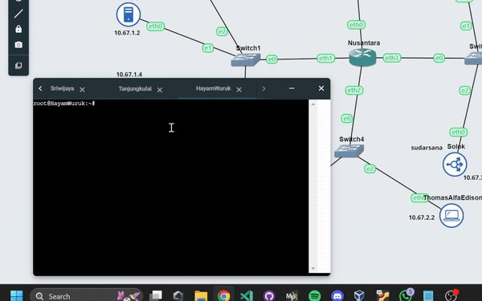

## Soal 18

Apa bila ada yang mencoba mengakses IP solok akan secara otomatis dialihkan ke www.solok.xxxx.com.

### Solok

install php-fpm untuk support lynx menggunakan nginx

```
apt-get install php-fpm -y
```

edit `/etc/nginx/sites-available/solok` menjadi, untuk redirect ke domain solok

```
upstream webserver  {
    server 10.67.1.4;
    server 10.67.1.5;
    server 10.67.1.6;
}

server {
    listen 80;
    server_name _;

    location / {
        proxy_pass http://webserver;
    }
}

server {
    listen 80;

    root /var/www/html;

    index index.php index.html index.htm;
    server_name www.solok.it07.com;

    location / {
        try_files $uri $uri/ /index.php?$query_string;
    }

    # pass PHP scripts to FastCGI server
    location ~ \.php$ {
        include snippets/fastcgi-php.conf;
        fastcgi_pass unix:/var/run/php/php7.0-fpm.sock;
    }

    location ~ /\.ht {
        deny all;
    }
}

server {
    listen 80 default_server;
    server_name _;
    return 301 http://www.solok.it07.com;
}
```

restart nginx

```
service nginx restart
```

### Testing


## Soal 19

Karena probset sudah kehabisan ide masuk ke salah satu worker buatkan akses direktori listing yang mengarah ke resource worker2.

salah satu worker:
**pilih bedahulu 👆**

### Sriwijaya (DNS Master)

edit `/etc/bind/named.conf.local` tambahkan zone baru untuk sekiantterimakasih

```
zone "sekiantterimakasih.it07.com" {
    type master;
    file "/etc/bind/it07/sekiantterimakasih.it07.com";
};
```

edit `/etc/bind/it07/sekiantterimakasih.it07.com` untuk ke ip kotalingga

```
;
; BIND data file for local loopback interface
;
$TTL    604800
@       IN      SOA     sekiantterimakasih.it07.com. root.sekiantterimakasih.it07.com. (
                              2         ; Serial
                         604800         ; Refresh
                          86400         ; Retry
                        2419200         ; Expire
                         604800 )       ; Negative Cache TTL
;
@       IN      NS      sekiantterimakasih.it07.com.
@       IN      A       10.67.1.5
www     IN      CNAME   sekiantterimakasih.it07.com.
```

restart bind

```
service bind9 restart
```

### Bedahulu (web server)

tambahkan server untuk domain sekiantterimakasih di `/etc/nginx/sites-available/cakra.sudarsana.it07.com`

```
server {
    listen 80;
    server_name sekiantterimakasih.it07.com www.sekiantterimakasih.it07.com;

    root /var/www/sekiantterimakasih.it07.com/dir-listing/worker2;
    index index.php index.html index.htm;

    location / {
        autoindex on;
        try_files $uri $uri/ =404;
    }
}
```

lalu untuk dirlistnya sendiri

```
wget --no-check-certificate 'https://docs.google.com/uc?export=download&id=1JGk8b-tZgzAOnDqTx5B3F9qN6AyNs7Zy' -O dir-listing.zip

unzip dir-listing.zip -d dir-listing

mkdir /var/www/sekiantterimakasih.it07.com

mv dir-listing/* /var/www/sekiantterimakasih.it07.com
```

restart nginx

```
service nginx restart
```

## Soal 20

Worker tersebut harus dapat di akses dengan sekiantterimakasih.xxxx.com dengan alias www.sekiantterimakasih.xxxx.com.

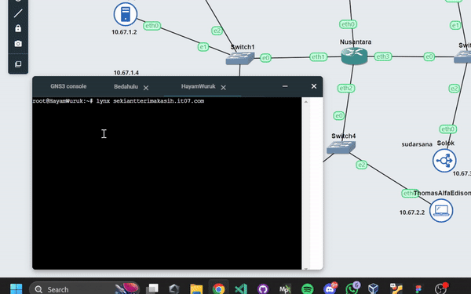

hamdalah
